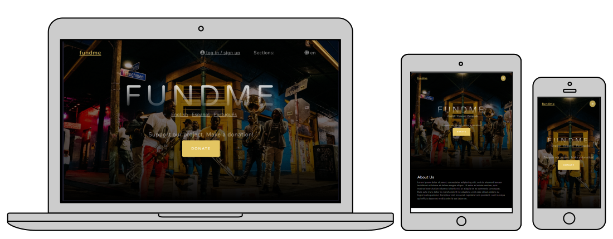
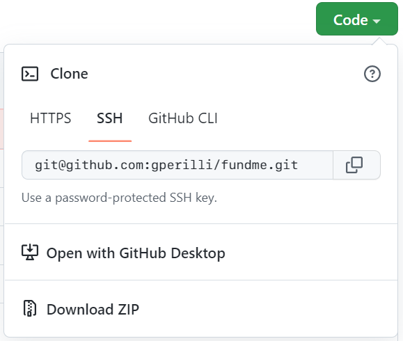

# FundMe

A simple stripe payments web app for funding a project through single payments, or subscriptions.

 
<br>

## Built With
- [Rails 6](https://guides.rubyonrails.org/) - Backend / Front-end
- [Heroku](https://heroku.com/) - Deployment
- [PostgreSQL](https://www.postgresql.org/) - Database
- [Bootstrap](https://getbootstrap.com/) — Styling
- [redis](https://redis.io/) - in memory data storage
- [sidekiq](https://github.com/mperham/sidekiq) - [background jobs](https://edgeguides.rubyonrails.org/active_job_basics.html) with sidekiq

## Set Up a Local Development Environment
Download this project code from this Github page. Either do a direct download or use a git clone command: 
```
git clone git@github.com:gperilli/fundme.git
```
<br>
 

For more information on getting git (version control system) on your local machine, see [this](https://git-scm.com/book/en/v2/Getting-Started-Installing-Git).

This is a ruby on rails web app, so first set up a rails development environment on your local machine. If you are using Windows, this will probably involve setting up [WSL](https://learn.microsoft.com/en-us/windows/wsl/install), Windows subsystem for Linux, [rbenv](https://github.com/rbenv/rbenv), a ruby environment manager, and Ruby, the language upon which Rails works. Next install [Node.js](https://nodejs.org/en/), [yarn](https://yarnpkg.com/), and [PostgreSQL](https://www.postgresql.org/), then you're good to go.

Install gems
```
bundle install
```
Install JS packages
```
yarn install
```
Install Rails:
```
gem install rails -v 6.0.3
```


### ENV Variables
API keys are required to run this app. In this case [Stripe](https://stripe.com/en-jp), for processing dummy/real payments, and [Gmail](https://accounts.google.com/signin), for using your own gmail account to send emails from the Rails mailer. My own private keys are deliberately ignored amongst all the files tracked by git, so please generate your own at Stripe, and Google, and then paste them into your own .env file. The Gmail app password can be generated by going to the security section of your Google account.

Create `.env` file
```
touch .env
```
Inside `.env`, set these variables.
```
PUBLISHABLE_KEY='pk_test_******'
SECRET_KEY='sk_test_*****'
GMAILAPP_PASSWORD='****************'
SIDEKIQ_USERNAME='******'
SIDEKIQ_PASSWORD='******'
```

### DB Setup
Run these commands to set up the database.
```
rails db:create
rails db:migrate
rails db:seed
```

### Run a server
Run this command to execute the Rails server, then go to `localhost:3000` to see the running app.
```
rails s
```

### Run Sidekiq to Handle Background Jobs
```
bundle exec sidekiq
```

## Contributing
Pull requests are welcome. For major changes, please open an issue first to discuss what you would like to change.

## License
[](https://creativecommons.org/licenses/by-nc-sa/4.0/)


